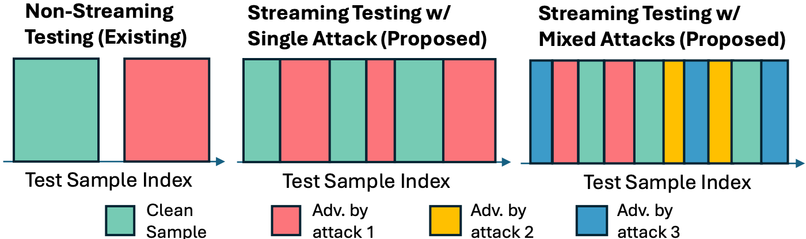

# Purified-Self-Training

This repository contains the official implementation of our paper:  
**[Improving Adversarial Robustness for 3D Point Cloud Recognition at Test-Time through Purified Self-Training](https://arxiv.org/abs/2409.14940)** 

We propose a robust self-training framework that improves test-time adversarial robustness for 3D point cloud classification, evaluated under a realistic adversarial data stream protocol.

### 🔧 Method: Robust Self-Training with Adaptive Thresholding and Alignment

We introduce a **self-training pipeline** that adapts to **unseen and evolving 3D adversarial attacks at test time**.  
Key components include:

- **Distribution alignment** to reduce domain shift between clean and adversarial samples
- **Adaptive thresholding** for reliable pseudo-labeling without supervision


### 📊 Evaluation: Realistic Streaming Protocol

We propose a novel **test-time evaluation protocol** that mimics a **realistic streaming scenario of adversarial data**.  
Our method consistently outperforms prior defenses in this challenging setting.




### 🔬Experiments

#### 1.Generate adversarial point cloud and purify it using diffusion model

​	manually choose to install dependencies that are not installed in your env

```
cd pointdp

bash setup.sh
pip install requirements.txt 

bash download.sh
# download scanobjectnn to ./data/h5_files from https://hkust-vgd.github.io/scanobjectnn/
# download pretrained weights to ./pretrained from https://drive.google.com/file/d/1At8fAHCKH_PDO71m4J8o_YoM5IlIniwN/view?usp=drive_link

```

  train difussion

```
# ModelNet40
CUDA_VISIBLE_DEVICES=0 python main.py --entry train  --exp-config ./configs/pure_ae/dgcnn_diffusion.yaml > ./output/pure_ae/dgcnn_diffusion_pure_ae.txt

# ScanobjectNN
CUDA_VISIBLE_DEVICES=0 python ./ScanObjectNN/main.py --entry train  --exp-config configs/scan_obj/pointMLP_diffusion_ae.yaml  > ./output/pure_ae/pointMLP_diffusion_ae_-ScanObjectNN.txt

```

attack & purify

```
# ModelNet40
CUDA_VISIBLE_DEVICES=0 python main.py --entry attack --model-path runs/dgcnn_cls_ae_diffusion_1/model_best_test.pth --exp-config configs/attack/pct_truncate_diffusion_pgd_naive.yaml --load_model_name PCT --confusion >> ./output/pct_truncate_diffusion_pgd_naive.out

# ScanobjectNN
CUDA_VISIBLE_DEVICES=0  python ./ScanObjectNN/main.py --entry attack --exp-config configs/scan_obj/pct_truncate_diffusion_pgd_naive.yaml --load_model_name PCT  > ./output/ScanObjectNN-pct_truncate_diffusion_pgd_naive.txt --confusion
```

​	find attacked / purified samples in  ./output


#### 2.IF-Defense

manually choose to install dependencies that are not installed in your env

```
cd IF-Defense
pip install requirements.txt 
cd ONet
python setup.py install
```

purify

```
CUDA_VISIBLE_DEVICES=0 python opt_defense.py --sample_npoint=1024 --train=False --rep_weight=500.0 --data_root=$data --label_root=$label
```

#### 3. Self-Training

build dependencies 

```
cd emd
python setup.py install
cd ..
cd networks && cd pointnet2_ops_lib
python setup.py install
```

simulate real scene samples

```
# need to modify purified samples dataroot to your own

bash simulate_data.sh
```

Run test-time training (TTT):

```
# ModelNet40
CUDA_VISIBLE_DEVICES=0 python stream_mix_attack.py --test_data $data --test_label $label --backbone $net

# ScanobjectNN
CUDA_VISIBLE_DEVICES=1 python ./scanobjectnn/stream_mix_attack.py --test_data $data --test_label $label --backbone $net
```

### 📚Citation

If you find our work useful, please consider cite our paper:

```
Lin, J., Yang, X., Li, T. and Xu, X., 2024. Improving Adversarial Robustness for 3D Point Cloud Recognition at Test-Time through Purified Self-Training. arXiv preprint arXiv:2409.14940.

```

### 🙏Acknowledgement

* [PointDP](https://proceedings.mlr.press/v202/sun23m/sun23m.pdf)
* [IF-Defense](https://github.com/Wuziyi616/IF-Defense)
* [TTAC2](https://github.com/Gorilla-Lab-SCUT/TTAC2)